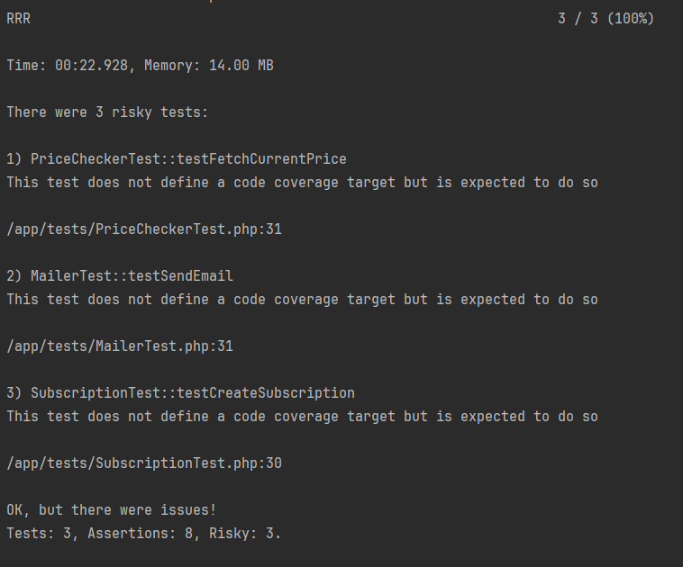
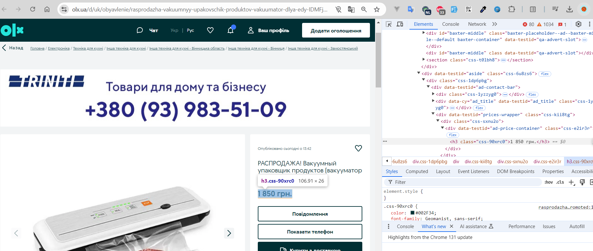
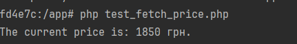

# Installation

### Clone the Repository

```bash
git clone https://github.com/Shaykhnazar/olx-price-monitor.git
```

### Build and Restart the Containers

```bash
docker-compose up -d
```
<hr>

# Database

### Access the MySQL Container

```bash
docker-compose exec db bash
```

### Log into MySQL as Root
```bash
mysql -u root -p
```
>Enter the password you set in MYSQL_ROOT_PASSWORD (e.g., "secret").

*List databases:*
```sql
SHOW DATABASES;
```
You should see olx_price_monitor in the list.

*List tables:*
```sql
SHOW TABLES;
```

*List subscriptions:*
```sql
SELECT * FROM subscriptions;
```
*Example:*
```shell
$ mysql -u root -p
Enter password: ********
mysql> USE olx_price_monitor;
Database changed
mysql> SHOW TABLES;
+---------------------+
| Tables_in_database  |
+---------------------+
| subscriptions       |
+---------------------+
1 row in set (0.00 sec)

mysql> exit;
Bye
```
<hr>

# Usage API via Postman

## Postman Collection
The Postman collection is available at [olx-price-monitor.postman_collection.json](olx-price-monitor.postman_collection.json).

1. Import the collection into Postman.
2. Open the collection in Postman.
3. Subscribe to an ad using the "Subscribe" endpoint. `/subscribe`
4. Confirm your subscription using the "Confirm" endpoint. `/confirm?token={token}`


# Running Tests

## Run all tests
Execute the entire test suite:

```bash
vendor/bin/phpunit
```

## Run a specific test file
To run tests from a specific file, provide the path:

```bash
vendor/bin/phpunit tests/SubscriptionTest.php
```

## Run a specific test method
To run a specific test method (e.g., testCreateSubscription), use the --filter option:

```bash
vendor/bin/phpunit --filter testCreateSubscription tests/SubscriptionTest.php
```

## Run with readable output
Use --testdox for a more human-readable output:

```bash
vendor/bin/phpunit --testdox
```

## Run with code coverage
Result:



### Price checking works via cron job
The price checking is done via cron job, so it should work as expected.
*Every **`1 hour`**, the cron job will check the price of the ad and send an email notification if the price has changed.*


### How works web parser
Using `voku/simple_html_dom` package. We can get the price from the web page.



And we get the price of the ad via the parser like this. This is to display for testing purpose only.


