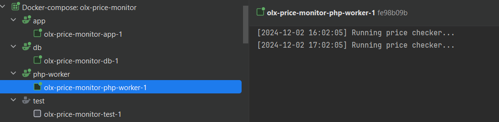

# Installation

## Clone the Repository

```bash
git clone https://github.com/Shaykhnazar/olx-price-monitor.git
```

### Build and Restart the Containers

```bash
docker-compose up -d
```

### Access the MySQL Container

```bash
docker-compose exec db bash
```

### Log into MySQL as Root
```bash
mysql -u root -p
```
>Enter the password you set in MYSQL_ROOT_PASSWORD (e.g., "secret").

*List databases:*
```sql
SHOW DATABASES;
```
You should see olx_price_monitor in the list.


# Running Tests

## Run all tests
Execute the entire test suite:

```bash
vendor/bin/phpunit
```

## Run a specific test file
To run tests from a specific file, provide the path:

```bash
vendor/bin/phpunit tests/SubscriptionTest.php
```

## Run a specific test method
To run a specific test method (e.g., testCreateSubscription), use the --filter option:

```bash
vendor/bin/phpunit --filter testCreateSubscription tests/SubscriptionTest.php
```

## Run with readable output
Use --testdox for a more human-readable output:

```bash
vendor/bin/phpunit --testdox
```

### Price checking works via cron
The price checking is done via cron, so it should work as expected.

